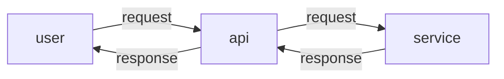
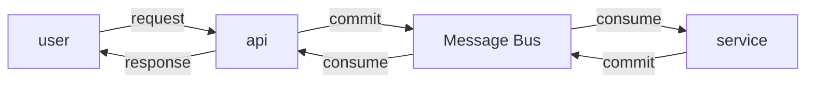

Async communication
====

## What?


https://www.youtube.com/watch?v=WMmoEBv5CNA

## Try

### Setup

#### Sync



#### Async



#### Run test

```
$ go test ./ -v

=== RUN   Test
=== RUN   Test/100
=== RUN   Test/100/sync
=== RUN   Test/100/async
=== RUN   Test/500
=== RUN   Test/500/sync
=== RUN   Test/500/async
=== RUN   Test/1k
=== RUN   Test/1k/sync
=== RUN   Test/1k/async
=== RUN   Test/10k
=== RUN   Test/10k/sync
=== RUN   Test/10k/async
--- PASS: Test (1.06s)
    --- PASS: Test/100 (0.01s)
        --- PASS: Test/100/sync (0.01s)
        --- PASS: Test/100/async (0.01s)
    --- PASS: Test/500 (0.05s)
        --- PASS: Test/500/sync (0.03s)
        --- PASS: Test/500/async (0.02s)
    --- PASS: Test/1k (0.09s)
        --- PASS: Test/1k/sync (0.05s)
        --- PASS: Test/1k/async (0.04s)
    --- PASS: Test/10k (0.90s)
        --- PASS: Test/10k/sync (0.50s)
        --- PASS: Test/10k/async (0.40s)
PASS
ok 1.490s
```

Spent time
====

```
- Test/100/sync:  7.777695ms
- Test/100/async:  6.232819ms (faster 20%)
- Test/500/sync:  28.300464ms
- Test/500/async:  21.98124ms (faster 22%)
- Test/1k/sync:  51.44744ms
- Test/1k/async:  42.417845ms (faster 17%)
- Test/10k/sync:  501.545807ms
- Test/10k/async:  401.150082ms (faster 20%)
```
